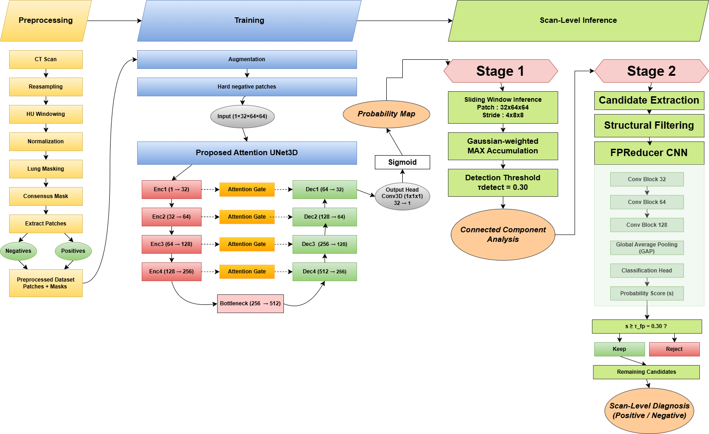

# 🫁 Deep Learning-Based 3D Segmentation of Pulmonary Nodules for Lung Cancer Detection

An end-to-end deep learning framework for automated pulmonary nodule segmentation and detection from volumetric chest CT scans, built on a customized 3D U-Net with attention gates and a two-stage detection pipeline.

Developed in PyTorch and MONAI as part of a Master's thesis in Data Science (Constantine 2 University), this repository covers preprocessing, training, scan-level inference, false-positive reduction, and evaluation on the LIDC-IDRI dataset — benchmarked against nnU-Net.

## Table of Contents
- [Motivation](#motivation)
- [Dataset](#dataset)
- [Method](#method)
- [Results](#results)
- [Limitations](#limitations)

## Motivation

Lung cancer is the leading cause of cancer death worldwide, and the leading cancer among Algerian men (14.7% of male cancer cases). Early, localized-stage detection raises 5-year survival to ~65%, versus ~10% at late-stage diagnosis. Automated nodule segmentation is what makes early detection scalable — but the published literature has three gaps this project targets directly:

1. **Data sampling bias** — most methods train only on positive, well-centered nodule patches and never learn what a false positive looks like.
2. **Patch-vs-scan mismatch** — models are trained on ~32×64×64 voxel patches but deployed on full scans of ~400M voxels; patch-level Dice (77–92% across reviewed methods) does not reflect real deployment performance, and this gap is rarely reported.
3. **Underrepresented hard cases** — ground-glass opacities (GGOs) and small nodules (≤6mm) are the most clinically significant (up to 88% malignancy rate on resection) and the most commonly ignored or excluded from evaluation, with reported Dice dropping to 59–68% when they *are* evaluated.

## Dataset

**LIDC-IDRI** — 1,018 multi-institution thoracic CT scans, each annotated independently by up to 4 radiologists. Ground truth was built as a consensus mask (≥50% rater agreement, minimum 2 raters), which also enables inter-annotator agreement analysis (see [Results](#results)).

| | |
|---|---|
| Patches extracted | 5,628 (1,876 positive / 3,752 negative) |
| Test set | 186 nodules across 80 unseen scans |
| Test set composition (texture) | 155 solid (83.3%) · 19 GGO (10.2%) · 12 part-solid (6.5%) |
| Test set composition (size) | 165 large (>6mm) · 21 small (≤6mm, 11.3%) |

Test split was stratified by texture, slice thickness, and nodule size to reflect real clinical heterogeneity.

## Method

### 1. Preprocessing
Each scan is standardized through 6 steps: resample to 1×1×1mm isotropic (trilinear interpolation) → HU windowing to remove bone/air → clip to [−1000, +400] → normalize to [0,1] → threshold-based lung masking → consensus mask construction (≥50% agreement, ≥2 raters).

### 2. Segmentation backbone
A 3D U-Net (encoder 32→512 channels, skip connections) with **attention gates** on the skip connections, so the decoder suppresses look-alike structures (vessel cross-sections, airway walls) instead of passing them through unfiltered. Loss: `0.5 × BCE + 0.5 × Dice` — needed because nodules occupy ~0.1% of voxels, so BCE alone would let the model collapse to all-background.

**Training strategy ablation** (each tested independently against the baseline):

| Configuration | Dice | Sensitivity | Detection |
|---|---|---|---|
| Baseline (positive patches + random negatives) | 0.794 | 80.2% | 99.5% |
| + Augmentation (flip/rotate/offset) | 0.804 | 81.9% | 98.9% |
| + GGO oversampling | 0.794 | 80.4% | 99.5% |
| + Hard negatives (vessels, lymph nodes, airways) | 0.792 | 80.8% | 100% |
| **+ Both (selected)** | **0.813** | **82.7%** | **100%** |

Hard-negative mining gave the largest detection gain; augmentation gave the largest GGO-specific gain (+0.031 Dice).

**Architecture ablation** (on top of the best training config): attention gates were selected — best Hausdorff distance (1.333mm vs. 1.393mm baseline) with no tradeoffs, versus residual blocks, deep supervision, or boundary-aware Dice loss (each tested, none improved on attention gates overall).

### 3. Scan-level inference (patch → full scan)
Patch-level Dice (0.813) does not transfer directly to a full scan: a scan is ~99% background vs. ~80% in training patches. Full-scan inference uses a sliding window (32×64×64) with Gaussian-weighted **max** accumulation over overlapping predictions (max, not average, to avoid suppressing small/GGO signal), thresholded at 0.30, with connected components ≥8 voxels kept as candidates.

**Stride ablation** — the single most impactful inference-time parameter:

| Stride | Overlap | CPM | Sensitivity | GGO | Small |
|---|---|---|---|---|---|
| 8×16×16 | 50% | 0.464 | 55.4% | 26.3% | 38.1% |
| **4×8×8** | **87.5%** | **0.682** | **91.4%** | **78.9%** | **76.2%** |

Tightening the stride alone — no retraining — took sensitivity from 55.4% to 91.4%, at the cost of ~1,000 raw candidates/scan (only ~2 of which are true nodules on average).

### 4. False-positive reduction
A lightweight second network scores each candidate from a 32×32×32 patch. Critically, its negative training examples are **hard negatives mined from Stage 1's own false positives** (vessels, lymph nodes, airway bifurcations) rather than random background. Two thresholds are tuned on the validation set: 0.30 for detection (candidate retention), 0.50 for the final segmentation mask.

## Results

**Final pipeline** (test set, scan-level):

| Metric | Value |
|---|---|
| Sensitivity | 91.4% (170/186 nodules) |
| CPM (LUNA16 protocol, mean sensitivity @ 7 FP/scan operating points) | 0.668 |
| FP/scan | 5.12 |
| TP Dice | 0.694 |

**Stratified by subgroup:**

| Subgroup | Sensitivity | TP Dice | n |
|---|---|---|---|
| Solid | 93.5% | 0.662 | 155 |
| GGO | 84.2% | 0.537 | 19 |
| Part-solid | 75.0% | 0.439 | 12 |
| Large (>6mm) | 92.7% | 0.649 | 165 |
| Small (≤6mm) | 81.0% | 0.525 | 21 |

**Patch-level vs. scan-level gap** (why this matters, and why patch-only Dice is misleading):

| Metric | Patch-level | Scan-level | Gap |
|---|---|---|---|
| Dice | 0.814 | 0.694 (TP only) | −0.120 |
| Sensitivity | 82.7% | 91.4% | +8.7% |
| Detection | 97.3% | 91.4% | −5.9% |

**Comparison with nnU-Net** (identical patient-level splits, scan-level evaluation, default nnU-Net config):

| System | Dice | Sensitivity | HD95 (mm) | Small Dice | GGO Dice |
|---|---|---|---|---|---|
| nnU-Net | 0.447 | 48.3% | 119.0 | 0.343 | 0.406 |
| **Proposed pipeline** | **0.694** | **91.4%** | — | **0.525** | **0.537** |

**Interpreting the Dice score — inter-annotator agreement:**
Under the same strict consensus protocol (≥50% agreement, ≥2 raters), independent radiologists agree with each other at a mean Dice of only **~0.450 overall** and **~0.418 on GGO**. The model's 0.694 overall / 0.537 GGO Dice sits within or above this human-agreement range — meaning the remaining gap largely reflects genuine annotation ambiguity in the task, not a model failure.

## Limitations

- **FP/scan (5.12) exceeds the clinical target of 1–2.** At 1 FP/scan, sensitivity drops to 69.9% — the current pipeline is **not yet deployment-ready**. Planned fix: larger, more diverse false-positive-reducer training data.
- **Small test set for the hardest subgroups** (GGO n=19, part-solid n=12): a single additional correct/incorrect detection shifts the reported sensitivity by ~5.3%, so these subgroup numbers should be read with wide uncertainty.
- **GGO Dice (0.537)**, while within human inter-annotator range, remains below what's clinically sufficient. Planned directions: weighted GGO loss, more GGO training data, ensembling.

